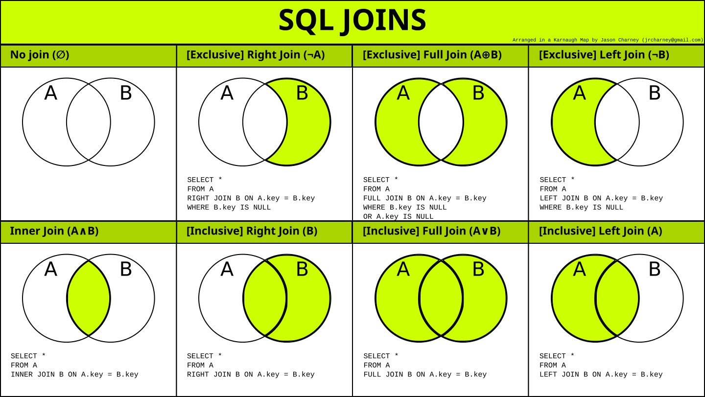

База данных (БД) - это организованная структура, предназначенная для хранения, изменения и обработки информации. Это структурированное хранилище данных.

<!--more-->



## Какие типы БД знаешь?

### Реляционные (SQL)

Характерны тем, что данные могут быть связанными между собой с помощью отношений _(relation - связь, отношение)_, например - значение одной колонки может ссылаться на какую-либо колонку в другой таблице (aka "внешние ключи"). Данные хранятся в виде набора таблиц, состоящих из столбцов и строк. В каждом столбце (column) хранятся данные определенного типа.

Схема таблиц объявляется при её создании.

Примеры: [MySQL](https://github.com/mysql/mysql-server) (**C++**) (или её форк [MariaDB](https://github.com/MariaDB/server)), [PostgreSQL](https://github.com/postgres/postgres) (**C**), [SQLite](https://github.com/sqlite/sqlite) (**C**)

### Не реляционные (NoSQL)

> **No**SQL - **N**ot **O**nly Structured Query Language

Обладают гибкими схемами, т.е. объявлять структуру помещаемых данных заранее часто не является обязательным условием.

#### Key/Value

Хранилища предоставляют доступ к данным, которые хранятся по уникальным ключам в "плоском" представлении. Чтобы запросить данные, нужно знать их ключ. Часто используется хранение данных в виде JSON-объектов, но для СУБД это просто некоторый случайный набор байт (blob-объект).

Примеры: [Redis](https://github.com/redis/redis) (**C**), [KeyDB](https://github.com/EQ-Alpha/KeyDB) (**C++**), [memcached](https://github.com/memcached/memcached) (**C**), [etcd](https://github.com/etcd-io/etcd) (**Go**)

#### Документные (документ-ориентированные)

Используют базовую семантику доступа и поиска хранилищ ключей и значений, часто имеют структуру дерева (иногда леса). Такие БД также используют ключ для уникальной идентификации данных. Разница между хранилищами "Key/Value" и документными БД заключается в том, что вместо хранения blob-объектов, документ-ориентированные базы хранят данные в структурированных форматах – `JSON`, `BSON` или `XML`.

Как следствие:

- Документы могут быть организованы (сгруппированы) в коллекции (их можно считать отдалённым аналогом таблиц реляционных СУБД)
- База данных не предписывает определенный формат или схему
- Каждый документ может иметь свою внутреннюю структуру
- Документные БД являются хорошим выбором для быстрой разработки
- В любой момент можно менять свойства данных, не изменяя структуру или сами данные

Примеры: [MongoDB](https://github.com/mongodb/mongo) (**C++**), [RethinkDB](https://github.com/rethinkdb/rethinkdb) (**C++**), [Elasticsearch](https://github.com/elastic/elasticsearch) (**Java**), [Aerospike](https://github.com/aerospike/aerospike-server) (**C**)

#### Колоночные

Внешне похожи на реляционные БД (хранят данные, используя строки и столбцы), но с иной связью между элементами. Данные группируются не по строкам, а по столбцам. В ней "соседними" являются не данные из двух столбцов одной и той же строки, а данные из одного и того же столбца, но из разных строк.

Особенностью является высокая скорость и гибкость выполнения сложных запросов. Действительно, в "строчной" СУБД при поиске и считывании значений сканируется вся таблица по строкам и столбцам, а затем извлекаются строки целиком, даже в том случае, если нужно только одно значение каждой из них. Колоночные базы данных позволяют искать значения по отдельным столбцам и извлекать **только те значения**, которые требуются.

Примеры: [ClickHouse](https://github.com/ClickHouse/ClickHouse) (**C++**), [Cassandra](https://github.com/apache/cassandra) (**Java**)

#### Графовые

Вместо сопоставления связей с таблицами и внешними ключами, графовые базы данных устанавливают связи, используя узлы, рёбра и свойства. Они представляют данные в виде отдельных узлов, которые могут иметь любое количество связанных с ними свойств.

Примеры: [Neo4j](https://github.com/neo4j/neo4j) (**Java**), [Dgraph](https://github.com/dgraph-io/dgraph) (**Go**), [RedisGraph](https://github.com/RedisGraph/RedisGraph) (**C**)

#### Time series (временны́х рядов)

Созданы для сбора и управления элементами, меняющимися с течением времени. Большинство таких БД организованы в структуры, которые записывают значения для одного элемента (например, временная метка и значение температуры процессора). В таблице может быть несколько метрик. Оптимизированы для быстрой записи данных.

Примеры: [Prometheus](https://github.com/prometheus/prometheus) (**Go**), [InfluxDB](https://github.com/influxdata/influxdb) (**Go**)

## Что такое CAP-теорема (теорема Брюера)?

Утверждение о том, что в любой реализации распределённых вычислений возможно обеспечить не более двух из трёх следующих свойств:

- **Согласованность данных** (`consistency`) - как только мы успешно записали данные в наше распределенное хранилище, любой клиент при запросе получит эти последние данные
- **Доступность** (`availability`) - в любой момент клиент может получить данные из нашего хранилища, или получить ответ об их отсутствии, если их никто еще не сохранял
- **Устойчивость к разделению** (`partition tolerance`) - потеря сообщений между компонентами системы (возможно даже потеря всех сообщений) не влияет на работоспособность системы

С точки зрения теоремы CAP, распределённые системы в зависимости от пары практически поддерживаемых свойств из трёх возможных распадаются на три класса:

- **CA** (`consistency + availability`) - во всех узлах данные согласованы и обеспечена доступность, при этом она жертвует устойчивостью к распаду на секции
- **CP** (`consistency + partition tolerance`) - в каждый момент обеспечивает целостный результат и способна функционировать в условиях распада, но достигает этого в ущерб доступности - может не выдавать отклик на запрос
- **AP** (`availability + partition tolerance`) - не гарантируется целостность, но при этом выполнены условия доступности и устойчивости к распаду на секции

> Что можно почитать:
- [CAP-теорема простым, доступным языком](https://habr.com/ru/post/130577/)
- [Недопонимание CAP-теоремы](https://habr.com/ru/post/136305/)

## Вопросы по SQL

### Из каких подмножеств состоит SQL?

- DDL (`Data Definition Language`, язык описания данных) -позволяет выполнять различные операции с базой данных, такие как `CREATE` (создание), `ALTER` (изменение) и `DROP` (удаление объектов)
- DML (`Data Manipulation Language`, язык управления данными) -позволяет получать доступ к данным и манипулировать ими, например, вставлять `INSERT`, обновлять `UPDATE`, удалять `DELETE` и извлекать данные `SELECT` из базы данных
- DCL (`Data Control Language`, язык контролирования данных) -позволяет контролировать доступ к базе данных; примеры -`GRANT` (предоставить права), `REVOKE` (отозвать права)

### Что подразумевается под таблицей и полем в SQL?

Таблица - организованный набор данных в виде строк и столбцов. Поле - это столбцы в таблице.

### В чем разница между операторами `DELETE` и `TRUNCATE`?

- `Delete` удаляет строку в таблице, а `truncate` удаляет **все строки**
- После `delete` возможно откатить изменения, а после `truncate` как правило нет
- `Truncate` работает быстрее

### Что такое соединения (`JOIN`) в SQL?

Это объединение строк из двух (или более) таблиц на основе связанного между ними столбца. Примеры JOIN-ов:

- `INNER JOIN` (внутреннее соединение) - пересечение двух таблиц, то есть строки, **общие для каждой из них** _(пример: `select * from a INNER JOIN b on a.a = b.b;`)_
- `LEFT OUTER JOIN` (левое внешнее соединение) - **все строки** из **первой** таблицы плюс все строки второй таблицы, **имеющие совпадение** со строками из первой таблицы _(пример: `select * from a LEFT OUTER JOIN b on a.a = b.b;`)_
- `RIGHT OUTER JOIN` (правое внешнее соединение) - **все строки** из **второй** таблицы плюс все строки первой таблицы, **имеющие совпадение** со строками из второй таблицы _(пример: `select * from a RIGHT OUTER JOIN b on a.a = b.b;`)_
- `FULL OUTER JOIN` (полное внешнее соединение) - полное соединение обеих таблиц (т.е. все строки из первой и второй таблиц); если соответствия нет, то значение `null` _(пример: `select * from a FULL OUTER JOIN b on a.a = b.b;`)_

> Что можно почитать:
> - [Примеры](https://ru.stackoverflow.com/a/512194/178575)

### В чем разница между типом данных `CHAR` и `VARCHAR` в SQL?

И `CHAR`, и `VARCHAR` служат символьными типами данных, но `VARCHAR` используется для строк символов переменной длины, тогда как `CHAR` используется для строк фиксированной длины. Например, `CHAR(10)` может хранить только 10 символов и не сможет хранить строку любой другой длины, тогда как `VARCHAR(10)` может хранить строку любой длины до 10, т.е. например 6, 8 или 2.

### Что такое первичный ключ (`Primary key`)?

Первичный ключ - столбец (или набор столбцов), которые **однозначно** идентифицируют каждую (одну) строку в таблице. Нулевые (`null`) значения **не допускаются**. Автоматически индексируются.

### Что такое ограничения (`Constraints`)?

Ограничения (`constraints`) используются для указания ограничения на тип данных таблицы. Они могут быть указаны при создании или изменении таблицы. Пример ограничений:

- `NOT NULL` - значение не может быть `null`
- `CHECK` - произвольные проверки на значение, например `constraint uuid_is_valid check (is_uuid(uuid))` проверяет на валидность UUID идентификатор, а `constraint login_min_length check (char_length(login) >= 3)` на минимальную длину строки поля логина
- `DEFAULT` - устанавливает значение по умолчанию для поля в колонке
- `UNIQUE` - обязывает значение бить уникальным в рамках таблицы
- `PRIMARY KEY` - объявляет первичный ключ
- `FOREIGN KEY` - объявляет внешний ключ (связывает таблицы отношением), например `constraint user_uuid_foreign_key foreign key (user_uuid) references users (uuid) on update cascade on delete cascade` обязывает содержать значение в `user_uuid` только для существующей записи в таблице `users` и автоматически обновится если оно будет изменено в таблице `users`, а так же заставит запись удалиться при удалении записи о пользователе

### Что такое уникальный ключ (`Unique key`)?

Уникальный ключ однозначно идентифицирует одну строку в таблице (таблица не может содержать дубликатов). В одной таблице может быть несколько уникальных ключей. **Возможны** нулевые (`null`) значения.

### Что такое внешний ключ (`Foreign key`)?

Внешний ключ поддерживает ссылочную целостность, обеспечивая связь между данными в двух таблицах. Внешний ключ в дочерней таблице ссылается на первичный ключ в родительской таблице. Ограничение внешнего ключа предотвращает действия, которые разрушают связи между дочерней и родительской таблицами.

### Что подразумевается под целостностью данных?

Целостность данных определяет точность, а также согласованность данных, хранящихся в базе данных. Она также определяет ограничения целостности для обеспечения соблюдения бизнес-правил для данных, когда они вводятся в приложение или базу данных.

> Например, вес детали должен быть положительным; количество знаков в телефонном номере не должно превышать 15; возраст родителей не может быть меньше возраста их биологического ребёнка и так далее.

## Индексы

### В чем разница между кластеризованным и не кластеризованным индексами в SQL?

Различия между кластеризованным и не кластеризованным индексами в SQL:

1. **Кластеризованный** индекс используется для простого и **быстрого** извлечения данных из базы данных, тогда как чтение из **не кластеризованного** индекса происходит относительно **медленнее**
2. **Кластеризованный** индекс изменяет способ хранения записей в базе данных — он **сортирует** строки по столбцу, который установлен как кластеризованный индекс, тогда как в не кластеризованном индексе он не меняет способ хранения, но создает отдельный объект внутри таблицы, который указывает на исходные строки таблицы при поиске
3. Одна таблица может иметь только **один кластеризованный индекс**, тогда как не кластеризованных у нее может быть много

