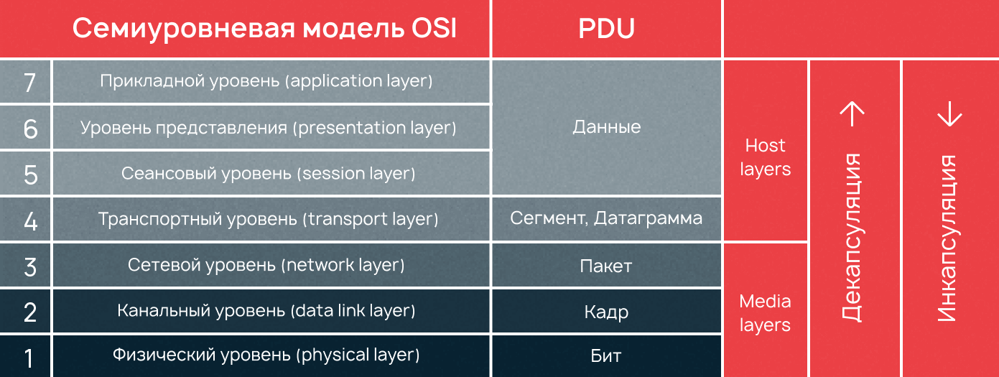
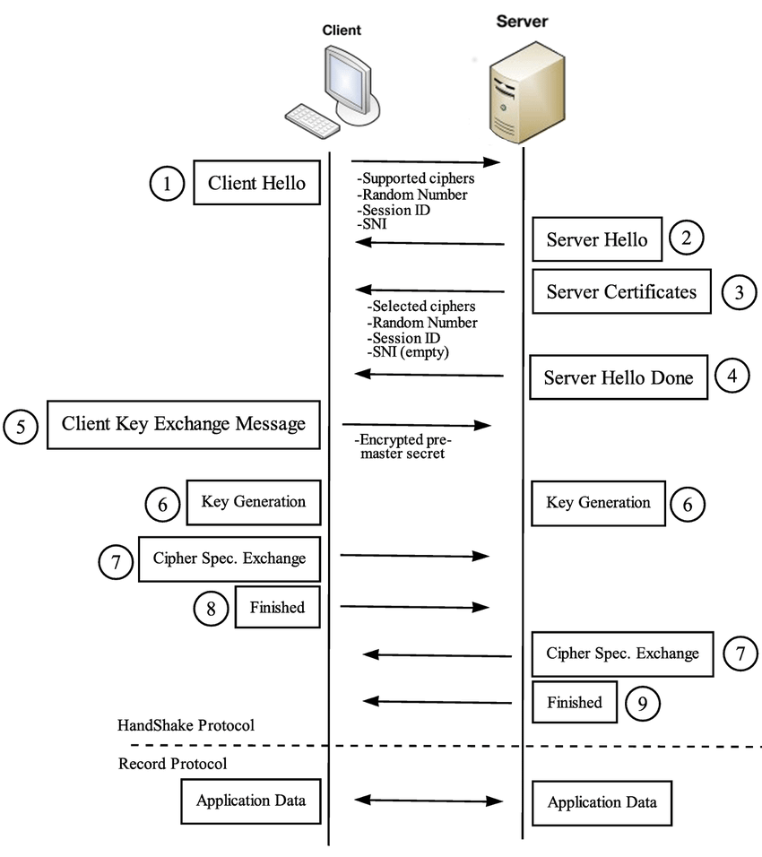

Часто на интервью задают вопросы связанные не только с основным/дополнительным ЯП или СУБД, но и с тем, как приложения взаимодействуют между собой используя сетевую коммуникацию. Для понимания того, как эти шестерёнки вращаются и что нужно иметь в виду отвечая на вопросы из этой серии и была написана эта заметка.

<!--more-->



## Что происходит после ввода адреса в браузер?

Адрес (по-другому URL), который был введён в строку адреса состоит из:

- Протокола, который используется для доступа к ресурсу (`http`, `https`, `ftp` и т.д.)
  - Если протокол введён не был, то браузер смотрит - есть ли он у него в списке [HSTS][hsts] (HTTP Strict Transport Security, механизм принудительно активирующий защищенное соединение через протокол `https`), и если домен есть у него в списке - запрос будет отправлен используя протокол `https`, иначе - `http` (включается он с помощью HTTP заголовка на сервере домена `Strict-Transport-Security: max-age=31536000; includeSubDomains; preload;`)
- Хоста или домена (`example.com`, `linux.org`)
- Номера порта (опционально)
  - Для общения с веб-сервером на запрашиваемом домене, нам нужно установить TCP соединение с определенным портом. В случае, если он указан явно (`http://1.1.1.1:8080`) - то используется он, а иначе - используется стандартный порт для запрошенного протокола (80 для `http`, 443 для `https`, и так далее)
- И запроса (query, ресурс, URN) - строки адреса ресурса (например - адрес страницы)

### DNS

После разбора адреса мы должны установить соединение с сервером, и сделать это по IP адресу (а не доменному имени, TCP/IP же), для чего нам нужно преобразовать имя домена в IP адрес _(другими словами - разрезолвить адрес; вообще, домены используются в первую очередь для удобства, и для возможности размещать несколько сайтов на одном домене)_. Для этого:

- Сперва браузер смотрит в свой кэш (браузера)
- Если там не обнаружено - то смотрит в файл `hosts` (в котором можно захардкодить любой IP для любого домена)
- Если и там нет, но смотрит в кэше операционной системы (`systemd-resolve`)
- Если нигде нет, то отправляется за адресом в сеть:
  - Отправляется запрос на сетевой DNS сервер (который был получен по DHCP или прописан ручками)
    - Если и у него нет, то он (сервер) идёт в корневой сервер, тот - в DNS сервер ответственный за зону (например - `.com`) - и так до тех пор, пока целевой NS (где хранятся записи) не будет найден
    - Когда целевой NS сервер достигнут (тот, где и содержится искомая запись для домена; обычно это `A` или `CNAME`) - то IP адрес сервера (`A` запись содержит IP, а вот с `CNAME` история резолвинга повторяется по кругу, так как она просто перенаправляет на другое доменное имя) возвращается по цепочке обратно (до запросившей её стороны), попутно кэшируясь на промежуточных серверах (если это необходимо и возможно)

### Отправка пакета

Далее, когда нам известен IP адрес сервера, мы можем сформировать и отправить запрос. Вспоминая устройство стека протоколов TCP/IP происходит следующее:

- На **прикладном уровне** (application layer) браузером формируется запрос к серверу (будь то DNS, HTTP, HTTPS и тому подобное)
- Далее, на **транспортном уровне** (transport layer, `TCP` или `UDP` протокол) в заголовки пакета добавляется порт, по которому нужно стучаться
- На **сетевом уровне** (network layer, `IP` протокол) добавляется IP адрес к нашему пакету
- На **канальном уровне** (data link layer) с помощью [ARP][arp] (Address Resolution Protocol, протокол предназначенный для определения MAC-адреса другого компьютера по известному IP-адресу) определяется "есть ли такой адрес в сети?"
  - Если адрес есть в сети - то к нему передаётся пакет
  - В противном случае пакет передаётся на шлюз, который, поднимаясь по уровням выше (смотря на то, какой IP адрес и смотря свою таблицу маршрутизации) - направляет пакет в нужном направлении (пока не закончится TTL протокола IP, либо пакет не достигнет пункта своего назначения)

### TLS Handshake

Если запрос был отправлен по протоколу `https`, то наступает пора установить защищенное соединение (TLS Handshake), для этого:

- Браузер отправляет `Client hello` серверу со своей версией протокола [TLS][tls] (например - `TLSv1.3`)
- Сервер отвечает клиенту сообщением `Server hello`, содержащим версию TLS, выбранным методом шифрования, методом компрессии и публичным сертификатом сервиса (подписанный центром сертификации; сертификат содержит публичный ключ, который будет использоваться клиентом для шифрования)
- Клиент подтверждает сертификат сервера с помощью своего списка центров сертификации (если сертификат сервера подписан центром из списка - то ему можно доверять)
- Клиент отправляет серверу некоторые данные, зашифрованные с помощью публичного ключа сервера
- Сервер расшифровывает сообщение с помощью своего приватного ключа и генерирует симметричный мастер-ключ
- Клиент отправляет серверу сообщение `Finished`, шифруя хэш передачи с помощью симметричного ключа
- Сервер генерирует собственный хэш, а затем расшифровывает полученный от клиента хэш что бы проверить совпадает ли он с собственным; если совпадение обнаружено - сервер отправляет клиенту `Finished`, а так же зашифрованный собственный симметричный ключ
- Далее клиент и сервер отправляют сообщения с помощью этого симметричного ключа

### HTTP запрос

На прикладном уровне браузер формирует запрос к серверу по `http` протоколу:

- В запрос вставляется используемый HTTP-метод (в нашем случае это будет `GET`)
- Далее указывается URN (запрос, или query-строка)
- Версия используемого протокола (например - `HTTP/1.1`)
- И на новой строке указывается заголовок `Host` с именем запрашиваемого домена (так как на одном IP может быть несколько виртуальных серверов) и другие заголовки, формируемые самим браузером или иным ПО

После формирования запроса на прикладном уровне он передаётся на транспортный уровень (и ниже) и по установленному ранее (в случае с `http`) TCP соединению доставляется на сервер. Сервер же:

- По номеру запрошенного порта определяет какому приложению он адресован
- Смотрит в HTTP-заголовок `Host` для определения какому сайту (виртуальному серверу) он был адресован
- Определяет, может ли виртуальный хост обработать запрошенный метод и куда его отдавать на обработку по запрошенному URN (строке запроса)

После обработки запроса сервер вернёт клиенту ответ на его запрос, содержащий версию HTTP протокола (в случае с `HTTP/2`), код ответа, и заголовки/тело запроса, если они имеются. Далее браузер уже принимает ответы от сервера и отображает страницу (рендерит её, HTML парсится во много проходов, для чего создаётся DOM и CSSOM).

[hsts]:https://ru.wikipedia.org/wiki/HSTS
[arp]:https://ru.wikipedia.org/wiki/ARP
[tls]:https://ru.wikipedia.org/wiki/TLS



## Перечисли все уровни модели OSI?



- **L7** - Приложений или Прикладной (Application layer), например `HTTP`, `FTP`, `WebSocket`
- **L6** - Представления (Presentation layer), например `ASCII`, `JPEG`
- **L5** - Сеансовый (Session layer), например `RPC`, `L2TP`, `gRPC`
- **L4** - Транспортный (Transport layer), например `TCP`, `UDP`, порты
- **L3** - Сетевой (Network layer), например `IPv4`, `IPsec`, `ICMP`
- **L2** - Канальный (Data Link layer), например `PPP`, `IEEE`, `Ethernet`, сетевая карта
- **L1** - Физический (Physical layer), например `USB`, `RJ` (витая пара), радиоканал



> Что можно почитать:
> - [Wiki: Сетевая модель OSI](https://ru.wikipedia.org/wiki/%D0%A1%D0%B5%D1%82%D0%B5%D0%B2%D0%B0%D1%8F_%D0%BC%D0%BE%D0%B4%D0%B5%D0%BB%D1%8C_OSI)

## Что такое IP адрес?

Это уникальный **внутри подсети** идентификатор устройства **сетевого** уровня модели OSI (протокола IP), который состоит из 4 байт (32 бита; в IPv6 используется 128 бит для кодирования адреса). Всего может существовать 4_294_967_296 адресов.

IP адрес у устройства может быть статический (не меняется и всегда остается одним и тем же) и динамический (назначается на определенное время, затем заменяется другим).

## Какие режимы передачи данных бывают?

Механизм передачи данных или информации между двумя связанными устройствами, соединенными по сети, называется режимом передачи.

- Симплексный - связь является однонаправленной, то есть данные могут передаваться только в одном направлении (как на улице с односторонним движением; пример - клавиатура, телевизионное вещание)
- **Полу**дуплексный - данные могут передаваться в обе стороны, но не одновременно (пример - рация)
- **Полно**дуплексный - данные могут **одновременно** передаваться в обе стороны (как на улице с двухсторонним движением)

## Расскажи про DHCP?

Dynamic Host Configuration Protocol (DHCP) - это прикладной протокол (**L7** по модели OS, передача данных производится при помощи протокола **UDP**), позволяющий сетевым устройствам автоматически получать IP-адрес и другие параметры (сетевую маску, адреса DNS серверов), необходимые для работы в сети TCP/IP. Доступен как для IPv4 (`DHCPv4`), так и для IPv6 (`DHCPv6`).

DHCPv4 включает три разных механизма распределения адресов:

- Ручное распределение (Manual Allocation) - администратор назначает предварительно установленный IPv4-адрес клиенту, а DHCP сервер передает IPv4-адрес на устройство
- Автоматическое распределение(Automatic Allocation) - DHCPv4 автоматически назначает статический IPv4-адрес на устройство, выбирая его из пула доступных адресов. Нет аренды (`lease`), и адрес постоянно назначается устройству
- Динамическое распределение (Dynamic Allocation) - DHCPv4 динамически назначает или дает в аренду IPv4-адрес из пула адресов в течение ограниченного периода времени, выбранного сервером, или пока клиент больше не нуждается в адресе

DHCPv4 работает в режиме клиент (порт `67`) - сервер (порт `68`). Когда клиент взаимодействует с сервером DHCPv4, сервер назначает или арендует IPv4-адрес этому клиенту. Он подключается к сети с этим арендованным IP-адресом до истечения срока аренды и должен периодически связываться с сервером DHCP, чтобы продлить аренду. Этот механизм аренды гарантирует, что клиенты, которые перемещаются или выходят из строя - не сохраняют за собой адреса, которые им больше не нужны. По истечении срока аренды сервер DHCP возвращает адрес в пул, где он может быть перераспределен по мере необходимости.

Рассмотрим процесс получения адреса:

- Когда клиент хочет присоединиться к сети, он начинает четырех-этапный процесс для получения аренды. Он запускает процесс с широковещательным (`broadcast`) сообщением `DHCPDISCOVER` со своим собственным MAC-адресом для обнаружения доступных DHCP-серверов. Поскольку у клиента нет способа узнать подсеть, к которой он принадлежит, у сообщения `DHCPDISCOVER` адрес назначения IPv4 адреса - широковещательный адрес `255.255.255.255` (т.е. отправляется всем устройствам в его сети на **сетевом** L3 уровне) и целевой MAC-адрес `FF:FF:FF:FF:FF:FF` (тоже является широковещательным для **канального** L2 уровня). А поскольку у клиента еще нет настроенного адреса IPv4, то исходный IPv4-адрес - `0.0.0.0`
- Когда DHCPv4-сервер получает сообщение `DHCPDISCOVER`, он резервирует доступный IPv4-адрес для аренды клиенту. Сервер также создает запись ARP, состоящую из MAC-адреса клиента и арендованного IPv4-адреса DHCP сервер отправляет связанное сообщение `DHCPOFFER` запрашивающему клиенту, как одноадресная передача (`unicast`), используя MAC-адрес сервера в качестве исходного адреса и MAC-адрес клиента в качестве адреса доставки
- Когда клиент получает `DHCPOFFER` с сервера, он отправляет обратно сообщение `DHCPREQUEST`. Это сообщение используется как для получения, так и для продления аренды
- При получении сообщения `DHCPREQUEST` сервер проверяет информацию об аренде с помощью ICMP-запроса на этот адрес, чтобы убедиться, что он уже не используется и создает новую ARP запись для аренды клиента, а затем отвечает одноадресным `DHCPACK`-сообщением. Это сообщение является дубликатом `DHCPOFFER`, за исключением изменения поля типа сообщения. Когда клиент получает сообщение `DHCPACK`, он регистрирует информацию и выполняет поиск ARP для назначенного адреса. Если ответа на ARP нет, клиент знает, что адрес IPv4 действителен и начинает использовать его как свой собственный

> Что можно почитать:
> - [Wiki: DHCP](https://ru.wikipedia.org/wiki/DHCP)

## Что такое ICMP?

Internet Control Message Protocol (ICMP) - это сетевой протокол (**L3** по модели OSI) который чаще всего используется для передачи сообщений об ошибках и других исключительных ситуациях, возникших при передаче данных. Хотя формально протокол использует IP (ICMP-пакеты инкапсулируются в IP пакеты), он является неотъемлемой частью IP-протокола и обязателен при реализации стека TCP/IP.

ICMP основан на протоколе IP. Каждое ICMP-сообщение инкапсулируется непосредственно в пределах одного IP-пакета, и, таким образом, как и **UDP** и в отличие от TCP, ICMP является т. н. «ненадежным» (не контролирующим доставку и её правильность).

Например, каждая машина, которая перенаправляет IP-пакеты (например маршрутизатор), уменьшает значение поля Time to live (`TTL`) заголовка IP-пакета на единицу; если `TTL` достигает 0, на источник пакета отправляется ICMP-сообщение о превышении `TTL`.

> Что можно почитать:
> - [Wiki: ICMP](https://ru.wikipedia.org/wiki/ICMP)

## Что такое TCP/IP?

Изначально **стек протоколов TCP/IP** разработан в 1972 году на основе Network Control Protocol, но только спустя 4 года создана передача данных с применением протокола TCP. К концу 80-х было выделено две отдельные функции – TCP и IP. И уже к 1983 году удалось полностью перейти на современный протокол, что и считается отправной точкой развития Интернета.

Стек модели TCP/IP контролирует взаимодействие различных уровней системы (стек делится на отдельные уровни, каждый из которых направлен на решение определенной задачи). Ключевыми в нем являются сами протоколы, которые встраиваются друг в друга (работают одновременно, без конфликтов, сбоев и незавершенных операций) и обеспечивают передачу данных.

### IP (Internet Protocol)

Маршрутизируемый протокол **сетевого уровня** модели стека протоколов TCP/IP, нужен для логической адресации устройств в компьютерной сети или сети передачи данных. Ключевые понятия о протоколе IP:

- Каждый узел на сетевом уровне в модели TCP/IP должен иметь **IP-адрес**, который состоит из 4 байт (`254.254.254.254`)
- Минимальной единицей измерения данных здесь является **IP-пакет** (который чаще всего инкапсулируется в Ethernet кадр)
- При доставке IP-пакета возможна его **фрагментация** (дробление) на более мелкие (получатель должен будет его собрать обратно). Так же возможен и запрет на фрагментацию (отправителю будет отправлен ICMP-сообщение об ошибке)
- Функция IP протокола заключается в том, чтобы **доставить пакет из точки А в точку Б** через множество промежуточных сетей (при этом IP-пакеты при передаче данных могут быть изменены, потеряны, повреждены, пакеты могут прийти получателю не в той последовательности, в которой они были отправлены - обо всем этом протокол IP не заботится, его задачей является организовать маршрут)
- Протокол использует передачу данных **без установки соединения**

Размер заголовка IP-пакета составляет от 20 (обычный заголовок без дополнительных опций) до 60 байт.

### TCP (Transmission Control Protocol)

Протокол **транспортного уровня**, управляющий передачей данных. Фактически, если IP протокол связывает между собой машины в сети, то **TCP связывает конкретные приложения используя порты** _(которых одновременно на машине может быть до 65535, т.к. номер порта занимает 2 байта)_. Ключевые характеристики:

- **Требует установки соединения** (для этого сервер делает passive open - ждёт входящие запросы, а клиент active open - отправляет серверу `SYN`, на что сервер должен ответить `ACK` + `SYN`, клиент в ответ на это должен ответить `ACK`, и после этого соединение считается установленным)
- Нумерует пакеты, посылает подтверждения о получении данных (`ACK`) и запрашивает повторную передачу, если данные не получены или искажены (или истёк таймаут для ответа)
- Любое установленное TCP-соединение симметрично, и пакеты с данными по нему всегда идут в обе стороны (двунаправленная взаимосвязь)
- Когда один из узлов решает, что пора заканчивать соединение, он посылает специальный пакет `FIN`, после этого узлы прощаются и разрывают соединение
- Использование принципа "скользящего окна" для увеличения скорости передачи (`ACK` не каждого сообщения, а определенной "пачки"; причём размер окна может меняться динамически)

### UDP (User Datagram Protocol)

Я бы рассказал отличную шутку про `UDP`, но боюсь, не до всех она дойдёт 😄



> Что можно почитать:
> - [Wiki: IP](https://ru.wikipedia.org/wiki/IP)
> - [IP-пакет в протоколе IPv4. Структура, заголовок и поля в IP-пакете](https://zametkinapolyah.ru/kompyuternye-seti/4-3-struktura-i-zagolovok-ip-paketa-v-protokole-ipv4.html)
> - [Протоколы TCP и UDP](https://professorweb.ru/my/csharp/web/level1/1_4.php)

## Какие бывают версии HTTP?

HTTP (HyperText Transfer Protocol) - это клиент-серверный протокол прикладного уровня, реализованный поверх протокола TCP/IP _(третья версия протокола работает используя UDP)_. Сам HTTP зависит от протокола TCP/IP (UDP), позволяющего посылать и отправлять запросы между клиентом и сервером. По умолчанию используется 80 порт TCP, но могут использоваться и другие (HTTPS, например, использует 443 порт).

Выполнить простейший HTTP запрос можно с помощью `telnet`:

```bash
$ telnet google.com 80
Trying 142.251.1.113...
Connected to google.com.
Escape character is '^]'.
GET /robots.txt HTTP/1.1
Host: google.com

# просто 2 пустые строки (2 раза нажми enter)
HTTP/1.1 301 Moved Permanently
(headers)
(content)
```

### `HTTP/0.9`

Появился в конце 1990 года (разработан Тимом Бернерсом-Ли) и был экстремально простым - запрос состоял из одной строки и умел только метод `GET` (`GET /mypage.html`), а ответ в свою очередь только контент ответа (обычно HTML; без заголовков) и даже без кода ответа.

```http request
GET /mypage.html

<HTML>
A very simple HTML page
</HTML>
```

### `HTTP/1.0`

[Спецификация (RFC 1945)](https://datatracker.ietf.org/doc/html/rfc1945) была опубликована в ноябре 1996 года. Информация о версии протокола теперь отправляется с каждым запросом (`GET /mypage.html HTTP/1.0`). Код ответа отправляется в самом начале ответа (`200 OK`). Добавлена **поддержка заголовков** (как запросов, так и ответов) для передачи мета-информации. К методу `GET` добавились `HEAD`, `POST`, `PUT`, `DELETE`, `LINK`, `UNLINK`. Кроме того, с помощью заголовка `Content-Type` стало возможным передавать разные типы контента:

```http request
GET /mypage.html HTTP/1.0
User-Agent: NCSA_Mosaic/2.0 (Windows 3.1)

200 OK
Date: Tue, 15 Nov 1996 08:12:31 GMT
Server: CERN/3.0 libwww/2.17
Content-Type: text/html
<HTML>
A page with an image 
</HTML>
```

Для каждого запроса и ответа между клиентом и сервером создаётся новое TCP-соединение (пожалуй, главный недостаток, поскольку каждое новое TCP-соединение требует "тройного рукопожатия", за которым следует [медленный старт](https://ru.wikipedia.org/wiki/%D0%9C%D0%B5%D0%B4%D0%BB%D0%B5%D0%BD%D0%BD%D1%8B%D0%B9_%D1%81%D1%82%D0%B0%D1%80%D1%82)).

### `HTTP/1.1`

Появился всего через несколько месяцев после версии `1.1` (в январе 1997 года, [RFC 2068](https://datatracker.ietf.org/doc/html/rfc2068), и по 2014 год выходили "дополнительные" RFC для этой версии протокола), и изменения были следующие:

- Соединение могло быть пере-использовано (не требуется постоянно поднимать новое TCP соединение для запроса, управляется с помощью заголовка `Connection: close` или `Connection: keep-alive`)
- Добавлена поддержка заголовка [`Host`][http-header-host] содержащего имя домена, для которого предназначен запрос (опционально и номер порта), что позволило держать на одном IP множество доменов (сайтов)
- Добавлены методы `OPTIONS`, `TRACE`, `PATCH`, `CONNECT` (последний добавлен в 2014 году)
- Добавлено согласование контента (включающее в себя язык [`Accept-Language: <lang>`][http-header-accept-language], кодировку [`Accept-Encoding: <directives>`][http-header-accept-encoding], тип данных - [`Accept: <mime_type>/*`][http-header-accept] и другие)
- Добавлены заголовки управления кэшированием контента ([`Cache-Control: <directives>`][http-header-cache-control], [`Expires: <http-date>`][http-header-expires], [`Last-Modified: <when>`][http-header-last-modified], [`ETag: <hash>`][http-header-etag] и другие)
- Добавлена возможность доставки контента частями _(или чанками, chunks)_, управляется заголовком [`Transfer-Encoding: <directives>`][http-header-transfer-encoding] и другими (в этом случае нет необходимости заранее знать точный размер всего тела HTTP-сообщения); HTTP/2 не поддерживает эту фичу, но имеет другие, более эффективные механизмы для потовой передачи данных
- Добавлена конвейерная обработка, позволяющая передавать сразу несколько запросов в одном соединении, не ожидая соответствующих ответов (но нужно помнить, что сервер должен отдавать ответы в строго той же последовательности, как получались запросы, и один затормозивший запрос тормозит все последующие в "пачке"); в HTTP/2 эта фича была заменена на мульти-плексирование
- Добавлена возможность использования заголовка [`Upgrade: <protocol>[/<version>]`][http-header-upgrade] для переключения на другой протокол, например `HTTP/2.0` или `WebSockets`, и эта функциональность присуща только версии `HTTP/1.1`

```http request
GET /en-US/docs/Glossary/Simple_header HTTP/1.1
Host: developer.mozilla.org
User-Agent: Mozilla/5.0 (Macintosh; Intel Mac OS X 10.9; rv:50.0) Gecko/20100101 Firefox/50.0
Accept: text/html,application/xhtml+xml,application/xml;q=0.9,*/*;q=0.8
Accept-Language: en-US,en;q=0.5
Accept-Encoding: gzip, deflate, br
Referer: https://developer.mozilla.org/en-US/docs/Glossary/Simple_header

200 OK
Connection: Keep-Alive
Content-Encoding: gzip
Content-Type: text/html; charset=utf-8
Date: Wed, 20 Jul 2016 10:55:30 GMT
Etag: "547fa7e369ef56031dd3bff2ace9fc0832eb251a"
Keep-Alive: timeout=5, max=1000
Last-Modified: Tue, 19 Jul 2016 00:59:33 GMT
Server: Apache
Transfer-Encoding: chunked
Vary: Cookie, Accept-Encoding

(content)
```

### `HTTP/2`

[Спецификация (RFC 7540)](https://datatracker.ietf.org/doc/html/rfc7540) была опубликована в мае 2015 года, основан на протоколе [SPDY][spdy] _(a.k.a "speedy", разработан Google в 2012 году, поддержка которого прекратилась в феврале 2015 в пользу `HTTP/2`; при его использовании время загрузки страниц уменьшалось на ~36%)_. В 2021 году порядка **50,2%** самых популярных сайтов поддерживают этот протокол.

В отличии от `HTTP/1.1`:

- Протокол стал **бинарным** (сообщения быстрее разбираются автоматически, но неудобны для чтения человеком), основные составляющие `HTTP/2` — фреймы (Frames) и потоки (Streams):
  - HTTP-сообщения состоят из одного или более фреймов (`HEADERS` для мета-данных, `DATA` для данных, `RST_STREAM` для прерывания потоков - при этом соединение останется открытым что позволяет работать остальным потокам, `SETTINGS`, `PRIORITY` и [другие](https://datatracker.ietf.org/doc/html/rfc7540#section-6))
  - Каждый запрос и ответ HTTP/2 получает **уникальный ID** потока и разделяется на фреймы
  - Фреймы представляют собой просто бинарные части данных; коллекция фреймов называется потоком (Stream)
  - Каждый фрейм содержит ID потока, показывающий, к какому потоку он принадлежит; а также каждый фрейм содержит общий заголовок (идентификатор потока уникален; каждый клиентский запрос использует **не**чётные id, а ответ от сервера — чётные)
- Добавлено **мультиплексирование** - передача нескольких асинхронных HTTP-запросов по одному TCP-соединению
  - Ответ сервера не имеет порядка, и клиент использует ID потока, чтобы понять, к какому потоку принадлежит тот или иной пакет
  - Клиенту не придётся простаивать, ожидая обработки длинного запроса, ведь во время ожидания могут обрабатываться остальные запросы
- Реализовано сжатие передаваемых заголовков (методом `HPACK`)
  - Клиент и сервер поддерживают единую таблицу заголовков
  - Повторяющиеся заголовки (например, `user-agent`) опускаются при повторных запросах и ссылаются на их позицию в таблице заголовков
  - Сами заголовки ничем не отличаются от `HTTP/1.1`, но добавились псевдо-заголовки вида `:method`, `:scheme`, `:host`, `:path`
- Появился Server Push - несколько ответов на один запрос
  - Сервер имеет право послать то содержимое, которое ещё не было запрошено клиентом, используя специальный фрейм `PUSH_PROMISE`
- Добавлена явная приоритизация запросов (используя фрейм `HEADERS` которым открывается поток, или в любое другое время используя фрейм `PRIORITY`)
- Повышена безопасность (хотя спецификация не требует шифрования для `HTTP/2`, оно всё равно станет обязательным по умолчанию, так как браузеры без шифрования не работают с этим протоколом)

Так же стоит знать, что мультиплексирование ведёт к проблеме доставки контента при ошибках на сетевом уровне. Представьте, что мы асинхронно выполняем 5 запросов к одному серверу. При использовании `HTTP/2` все эти запросы будут выполняться в рамках одного TCP-соединения, а значит, если один из сегментов любого запроса потеряется или придёт неверно, передача всех запросов и ответов остановится, пока не будет восстановлен потерявшийся сегмент (у этой проблемы есть и название - "head-of-line blocking"). Очевидно, что **чем хуже качество соединения, тем медленнее работает HTTP/2** (когда потерянные пакеты составляют всего **2%** от всех, `HTTP/1.1` в браузере показывает себя лучше, чем `HTTP/2` за счёт того, что открывает 6 соединений, а не одно).

### `HTTP/3`

Проектируется для решения проблем `HTTP/2` и сейчас проходит тестирование с опубликованной спецификацией. Новый протокол должен решать текущие проблемы скорости, надёжности и безопасности для широкого сектора устройств. `HTTP/3` строится на основе нового протокола [QUIC][quic], разрабатываемого в Google с 2012 года. Основные отличия от предшественника:

- Вместо TCP будет использоваться **UDP**
- QUIC сам обеспечивает мультплексирование, и потеря одного пакета повлияет только на имеющий к этому пакету поток, другие потоки в рамках соединения продолжат свою работу
- Заголовки запросов и ответов сжимаются `QPACK` вместо `HPACK`
- Для шифрования используется TLS 1.3 (эффективно использующийся в HTTPS) - оно включено в протокол
  - Это позволяет устанавливать соединение и обмениваться публичными ключами за одно рукопожатие, а также позволяет использовать хитрый механизм 0-RTT handshake и вообще избежать задержек при рукопожатии
  - Кроме того, теперь можно шифровать отдельные пакеты данных (это позволяет не ждать завершения приёма данных из стрима, а расшифровывать полученные пакеты независимо)
- Концепция лёгких стримов позволяет отвязать соединение от IP-адреса клиента (например, когда клиент переключается с одной Wi-Fi точки доступа на другую, изменяя свой IP - при использовании TCP происходит длительный процесс, в ходе которого существующие TCP-соединения отваливаются по таймауту; в случае с QUIC, клиент просто продолжает посылать серверу пакеты с нового IP со старым ID стрима)
- QUIC реализуется на уровне приложения, а не операционной системы (позволяет быстрее вносить изменения в протокол, т.к. чтобы получить обновление достаточно просто обновить библиотеку, а не ждать новую версию ОС)

Последние версии браузеров Chrome, Firefox, Edge, Opera и некоторые мобильные браузеры уже поддерживают работу по HTTP/3, но для работы должна быть и поддержка со стороны сервера. На данный момент `HTTP/3` активно используется в Google и Cloudflare.

По статистике на июль 2021 года только 20% вебсайтов доступны по `HTTP/3`. По отчетам Google через gQUIC страницы загружаются примерно на 5% быстрее, а в потоковом видео на 30% меньше подвисаний по сравнению с TCP.

К слабым сторонам протокола пока что можно отнести высокое потребление CPU, жадность (unfairness) к пропускной способности канала и более медленная передача небольших (до 10 кб) объектов. А так же неготовность интернета к полному переходу на UDP.

> Что можно почитать:
> - [Evolution of HTTP](https://developer.mozilla.org/ru/docs/Web/HTTP/Basics_of_HTTP/Evolution_of_HTTP)
> - [Путь к HTTP/2](https://habr.com/ru/post/308846/)
> - [HTTP/3: прошлое, настоящее и будущее](https://ru.hexlet.io/blog/posts/http-3-proshloe-nastoyaschee-i-buduschee)
> - [Введение в HTTP/2](https://developers.google.com/web/fundamentals/performance/http2?hl=ru)

[http-header-host]:https://developer.mozilla.org/ru/docs/Web/HTTP/Headers/Host
[http-header-accept]:https://developer.mozilla.org/en-US/docs/Web/HTTP/Headers/Accept
[http-header-accept-encoding]:https://developer.mozilla.org/en-US/docs/Web/HTTP/Headers/Accept-Encoding
[http-header-accept-language]:https://developer.mozilla.org/en-US/docs/Web/HTTP/Headers/Accept-Language
[http-header-cache-control]:https://developer.mozilla.org/en-US/docs/Web/HTTP/Headers/Cache-Control
[http-header-expires]:https://developer.mozilla.org/en-US/docs/Web/HTTP/Headers/Expires
[http-header-last-modified]:https://developer.mozilla.org/en-US/docs/Web/HTTP/Headers/Last-Modified
[http-header-etag]:https://developer.mozilla.org/en-US/docs/Web/HTTP/Headers/ETag
[http-header-transfer-encoding]:https://developer.mozilla.org/en-US/docs/Web/HTTP/Headers/Transfer-Encoding
[http-header-upgrade]:https://developer.mozilla.org/en-US/docs/Web/HTTP/Headers/Upgrade
[spdy]:https://ru.wikipedia.org/wiki/SPDY
[quic]:https://ru.wikipedia.org/wiki/QUIC

## Как работает HTTPS?

Проблема протокола HTTP в том, что данные передаются по сети в открытом **незашифрованном виде**. Это позволяет злоумышленнику слушать передаваемые пакеты и извлекать любую информацию из параметров, заголовков и тела сообщения. Для устранения уязвимости был разработан **HTTPS** (**S** в конце значит **Secure**) - он, хоть не является отдельным протоколом, всего лишь HTTP поверх SSL (а позже TLS), позволяет безопасно обмениваться данными. В отличие от HTTP со стандартным TCP/IP портом 80, для HTTPS используется порт 443.

Для того, чтоб ваш сервер был доступен по `https` необходимо выпустить сертификат, подписанный центром сертификации (который является доверенным), и сконфигурировать используемое ПО на его использование.

### SSL

**Secure Sockets Layer** (SSL) - это криптографический протокол, обеспечивающий безопасное общение пользователя и сервера по небезопасной сети. Располагается между транспортным уровнем и уровнем программы-клиента (FTP, HTTP и т.п.). С 2015 года признан полностью устаревшим.

### TLS

**Transport Layer Security** - это развитие идей, заложенных в протоколе SSL. На данный момент актуальной является версия `TLSv1.3`. Протокол обеспечивает услуги: приватности (сокрытие передаваемой информации), целостности (обнаружение изменений), аутентификации (проверка авторства). Достигаются они за счет гибридного шифрования, то есть совместного использования ассиметричного и симметричного шифрования.

### Шифрование

**Симметричное шифрование** предполагает наличие общего ключа одновременно у отправителя и получателя, с помощью которого происходит шифровка и дешифровка данных.

При использовании **ассиметричного шифрования** существует открытый ключ, который можно свободно распространять, и закрытый ключ, который держится в секрете у одной из сторон. Этот тип работает медленно, относительно симметричного шифрования, однако скомпрометировать закрытый ключ сложнее.

Чтобы решить проблему производительности (шифровать ассиметрично абсолютно все - сложно), в TLS используется **гибридное шифрование** - общий ключ для симметричного шифрования данных передается от клиента серверу зашифрованным открытым ключом сервера, после этого сервер может его расшифровать своим закрытым ключом и использовать для обмена данными с клиентом.

Для установки безопасного соединения происходит TLS Handshake, который схематично выглядит следующим образом:



> Что можно почитать:
> - [Основы HTTPS, TLS, SSL](https://habr.com/ru/post/593507/)
